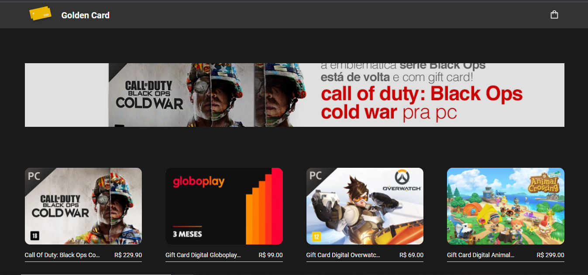

# golden card

View app   
https://golden-card.vercel.app/ 

# Tecnologias 
- [Next js](https://nextjs.org/)
- [sass](https://sass-lang.com/)
- [stripe](https://stripe.com/br)
- [js-cookie](https://www.npmjs.com/package/js-cookie)

# how use
1. Clone este repositório
    * `git clone https://`
2. api key
    * Se register no [stripe](https://stripe.com) 
    * pegue sua [api key](https://dashboard.stripe.com/login?redirect=%2Faccount%2Fapikeys) 
    * coloque sua api key no `.env`
3. Instalar dependências
    * `yarn install`
4. Execute o app
    * `yarn dev`
